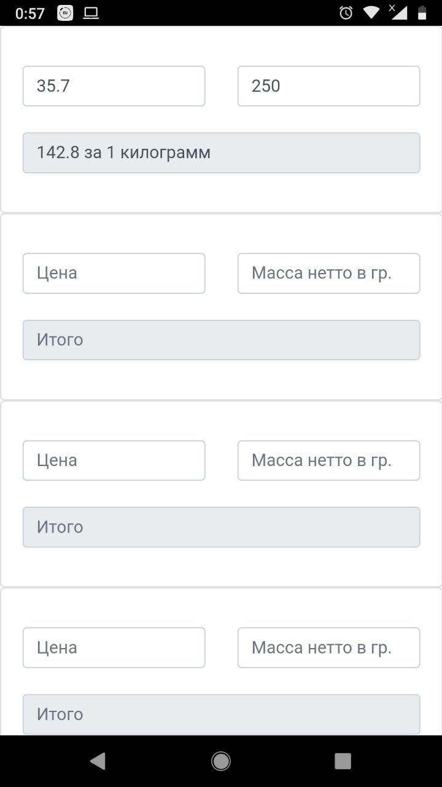

# Kilocalc
Очень простой калькулятор для подсчёта стоимости продукта за килограмм  

## Задумка
У автора часто возникает ситуация, когда по приходу в магазин он видит на полках много продуктов разного развеса и стоимости. Возникает ситуация
когда хочется взять среди прочих равных продукт по более выгодной цене. Калькулятор в телефоне штука хорошая, но каждый раз открывать историю
операций не очень хочется. В связи с этим радилась идея этого простого калькулятора для стоимости продукта за килограмм.  

## Стек
Приложение написано на html\css\js и сконвертированно в стандартное приложение для операционной системы android.

### Ссылки
*  [Adobe Phonegap Build](https://build.phonegap.com/) - онлайн-конвертер проекта в приложение для телефона
*  [Apache cordova](https://cordova.apache.org/) - каркас для создания приложений для телефонов с использованием webview
*  [Bootstrap](https://getbootstrap.com/) - css\js каркас для оформления
*  [icons8.com](https://icons8.com/icons/pack/free-icons) - иконка для приложения

### Порядок сборки
1.  Скачиваем проект
2.  Следующие файлы и папки помещаем в один ZIP-архив с любым именем:
    *  Папку `www`
    *  Файл `config.xml`
    *  Файл `favicon.png`
3.  Переходим на [сайт конвертера](https://build.phonegap.com/) и регистрируемся
4.  Заходим в раздел [приложений](https://build.phonegap.com/apps)
5.  Выбираем с компьютера созданный архив
6.  Ждём пока конвертер создаст пакет приложения для телефона
7.  Качаем и радуемся

## Скриншоты

## Лицензия
Максимально свободная - MIT